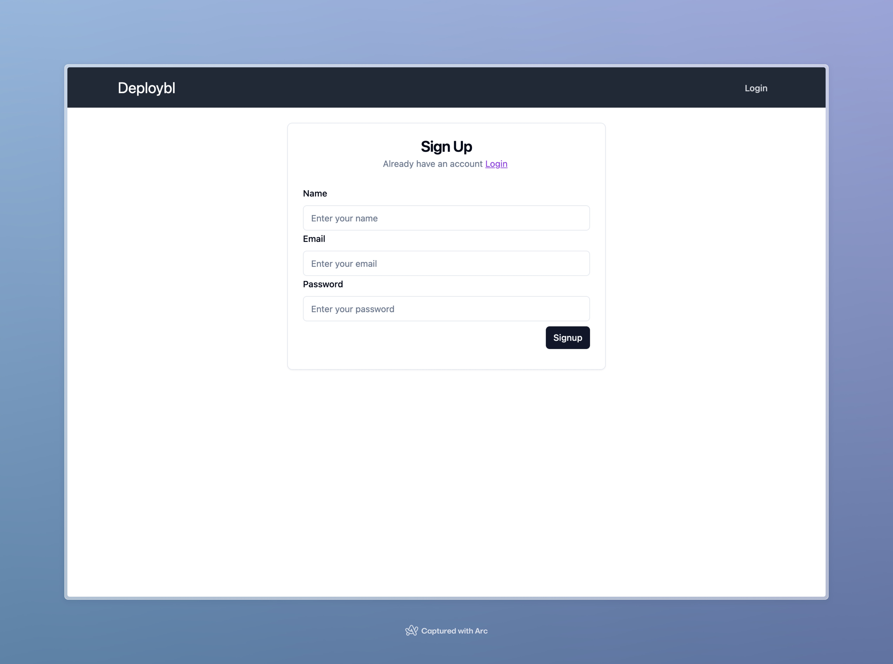
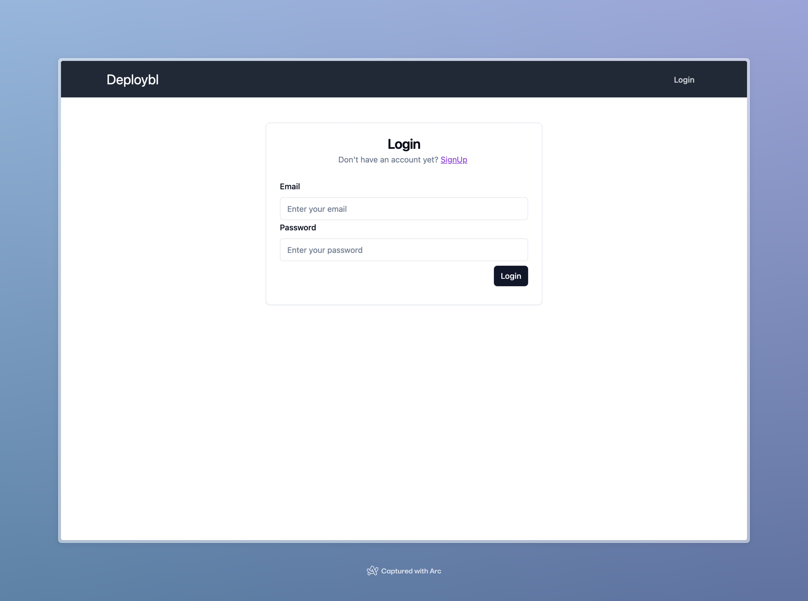
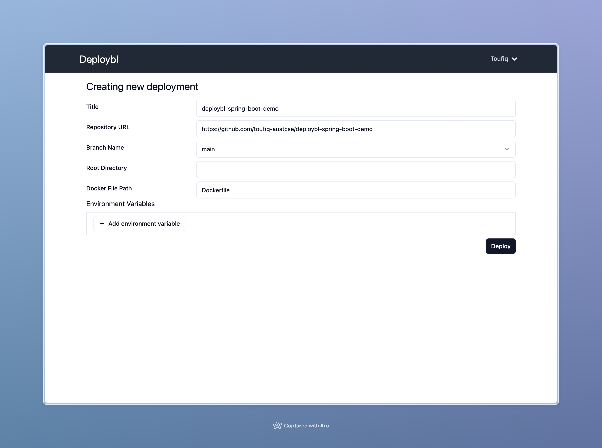

# Deploybl
Deploybl is a Platform as a Service (PaaS) that simplifies the deployment and management of applications.

</img>
## Table Of Contents
- [Features](#features)
- [Technologies](#technologies)
- [Frontend](#frontend)

## Features
* User Login/Registration
* Deploy any type of application (Node.js, Java, Go, etc.). No need to buy and configure a server.
* Generate a unique URL for each deployment. No need to buy and configure a domain.
* Manage Deployments
* View Deployment Logs

## Technologies

* [Go](https://golang.org/) - As Backend Language
* [Gin](https://github.com/gin-gonic/gin) - As Web Framework
* [Traefik](https://traefik.io/) - As Reverse Proxy
* [MongoDB](https://www.mongodb.com/) - As Database
* [Firebase](https://firebase.google.com/) - For Authentication
* [RabbitMQ](https://www.rabbitmq.com/) - As Job Queue
* [AWS S3](https://aws.amazon.com/s3/) - For log storage
* [Next.js](https://nextjs.org/) - For developing dashboard
* [shadcn/ui](https://ui.shadcn.com/) - UI compoenent
* [Tailwind CSS](https://tailwindcss.com/) - For styling
* [Docker](https://www.docker.com/) - For deployment

## Frontend

 Signup Page 

 
 Login Page 

 
 Dashboard Page 

 
 Init New Deployment 

 
 Create New Deployment 

 
Deployment Events

 
 Deployment Event Logs 

 
 Deployment Settings 

 
 Deployment Env Update 

